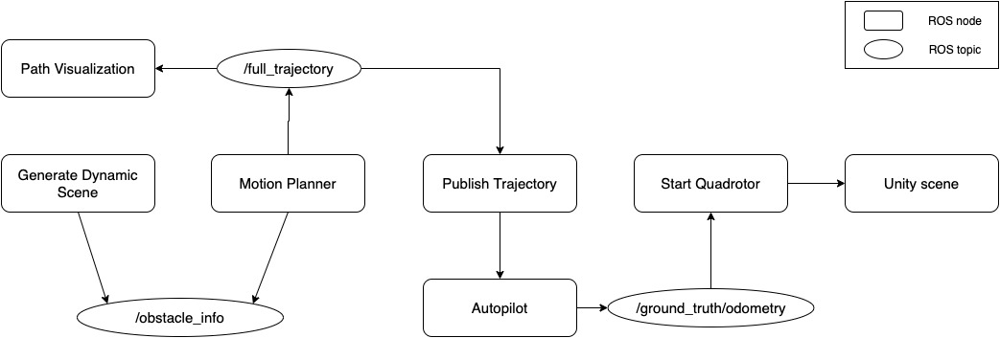
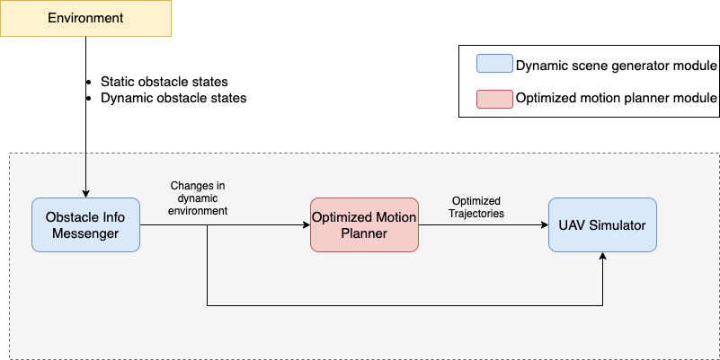

# hdi_plan
An optimized motion planning framework that integrates optimized motion planner and UAV simulator. The [stand-alone optimized motion planner part](https://github.com/test-bai-cpu/optimized_motion_planner) is also open-sourced at github.

## Prerequisites

**ROS**: The ROS version is Noetic Ninjemys. The installation instruction is [here](http://wiki.ros.org/noetic/Installation).

**Gazebo**: The installation instruction is [here](http://gazebosim.org/tutorials/?tut=ros_wrapper_versions#ROS1Noetic).

**Flightmare**: Flightmare is a flexible modular quadrotor simulator, which is utilized in this framework. The introduction and installation instruction are in the project [website](https://uzh-rpg.github.io/flightmare/).

**RPG Quadrotor Control**: The [repository](https://github.com/uzh-rpg/rpg_quadrotor_control) contains a complete framework for flying quadrotors based on control algorithms.

## Summary
The ROS framework is:



The scheme of the framework is:


As shown in the scheme above, the optimized motion planning framework consists of two modules, which are optimized motion planner and dynamic scene generator. The optimized motion planner is constructed based on RRTX and CHOMP algorithm, referencing RRTXstatic class in OMPL library, Julia code in RRTX paper, and CHOMP planner code in MoveIt. The dynamic scene generator supports simulation. Quadrotor, obstacles ,and planned trajectories can be visualized in the same Unity scene.

## Run example

```bash
roslaunch hdi_plan with_dynamic_ob.launch
```

## To do
- refactor for proper names, including repo name, class name, and variable name.
- clear unnecessary and redundant code, remove debug part.


## References

- <a name="flightmare"></a>Song, Yunlong & Naji, Selim & Kaufmann, Elia & Loquercio, Antonio & Scaramuzza, Davide. (2020). Flightmare: a flexible quadrotor simulator. 
- <a name="RPGQuadrotorControl1"></a>M. Faessler, A. Franchi, and D. Scaramuzza, Differential Flatness of Quadrotor Dynamics Subject to Rotor Drag for Accurate Tracking of High-Speed Trajectories, IEEE Robot. Autom. Lett. (RA-L), vol. 3, no. 2, pp. 620–626, Apr. 2018.
- <a name="RPGQuadrotorControl2"></a>M. Faessler, D. Falanga, and D. Scaramuzza, Thrust Mixing, Saturation, and Body-Rate Control for Accurate Aggressive Quadrotor Flight, IEEE Robot. Autom. Lett. (RA-L), vol. 2, no. 2, pp. 476–482, Apr. 2017.
- <a name="RRTX"></a>Otte M, Frazzoli E. RRTX: Asymptotically optimal single-query sampling-based motion planning with quick replanning. The International Journal of Robotics Research. 2016;35(7):797-822.
- <a name="CHOMP"></a>Matthew Zucker, Nathan Ratliff, Anca Dragan, Mikhail Pivtoraiko, Matthew Klingensmith, Christopher Dellin, J. Andrew (Drew) Bagnell and Siddhartha Srinivasa Journal Article, International Journal of Robotics Research, Vol. 32, No. 9, pp. 1164-1193, Aug. 2013
- <a name="OMPL"></a>Ioan A. Șucan, Mark Moll, Lydia E. Kavraki, The Open Motion Planning Library, IEEE Robotics & Automation Magazine, vol. 19, no. 4, pp. 72-82, Dec. 2012.
- <a name="MoveIt"></a>David Coleman, Ioan A. Șucan, Sachin Chitta, Nikolaus Correll, Reducing the Barrier to Entry of Complex Robotic Software: a MoveIt! Case Study, Journal of Software Engineering for Robotics, 5(1):3–16, May 2014.
